# Void Linux, installation

C'est parti pour une installation de @VoidLinux

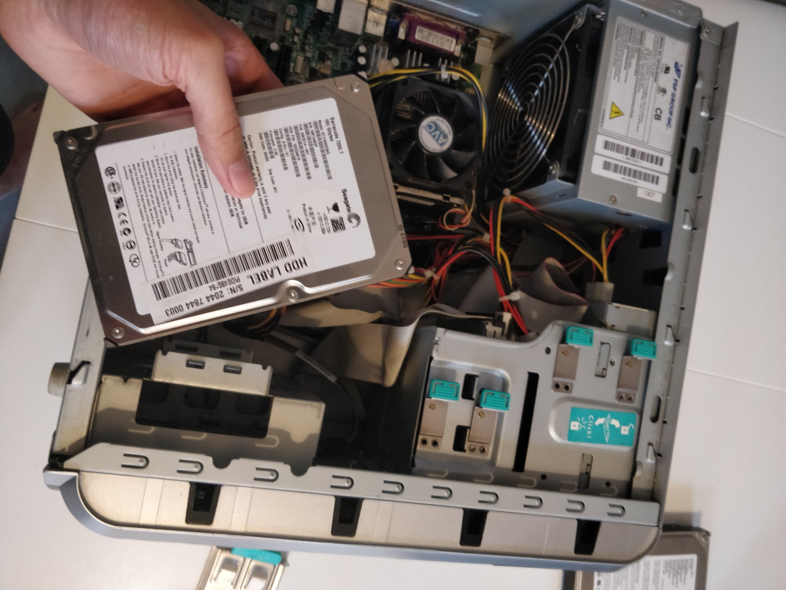

Un peu de contexte, pourquoi cette distribution? Je recycle un vieux pc windows XP avec les caractéristiques suivantes (pas de matériel supplémentaire pour le "booster" pour l'instant) :

- Pentium 4
- 160G de stockage
- 500Mo de mémoire

(RIP windows xp)

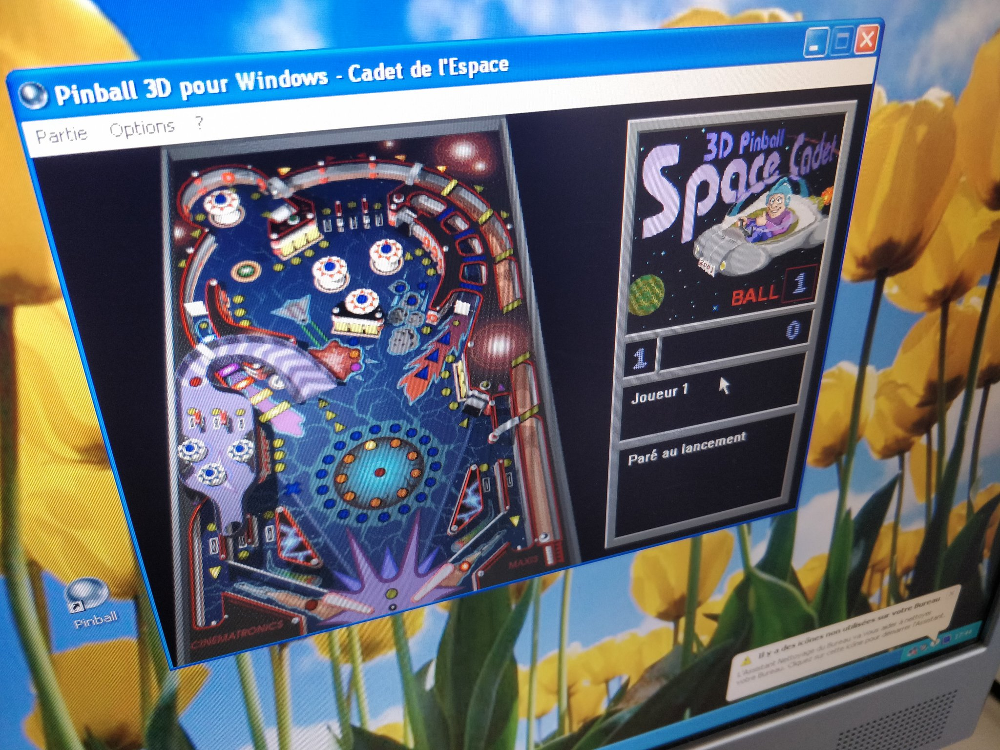

J'avais donc besoin d'une distribution particulièrement légère qui supporte les architectures i686 et s'installe avec strictement moins de 500Mb. (Même archlinux demande 530Mb).

De plus je voulais absolument une distribution stable (je compte l'utiliser comme serveur de fichier), mais en rolling release (sécurité).

Dernière contrainte : il est 18h30, un dimanche soir et je n'ai pas de clef USB sous la mais. MAIS j'ai un vieux cd lubuntu que j'ai exhumé d'un carton, il a au moins 2 ans. Il faut donc que ma distribution puisse s'installer facilement avec la méthode chroot.

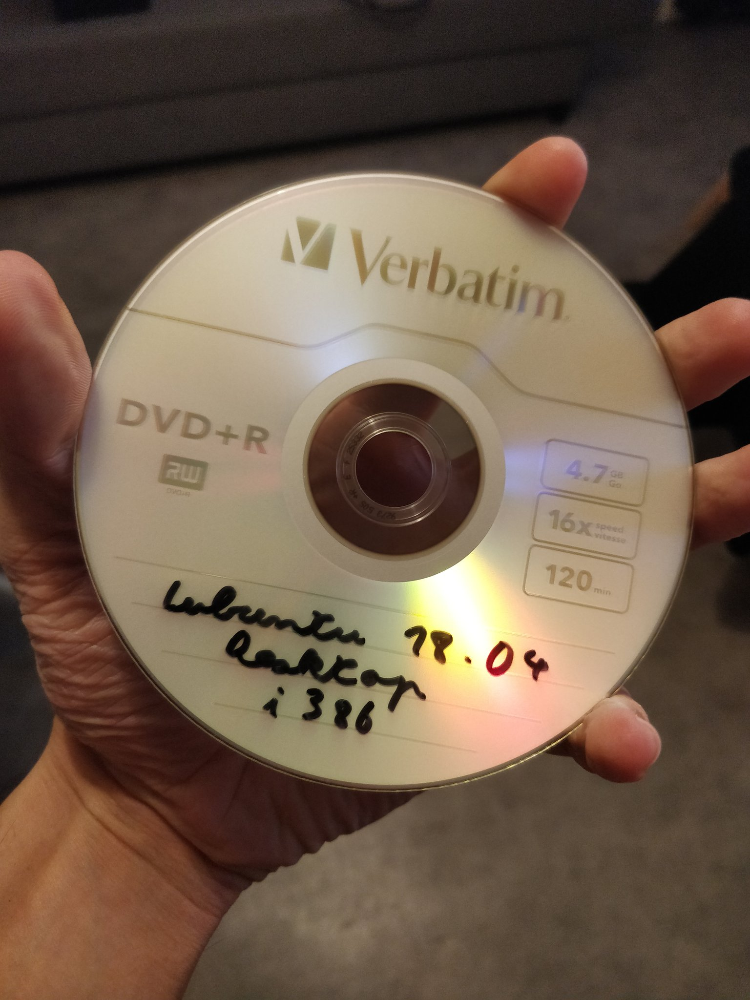

Heureusement void rempli normalement tous les critères :

https://docs.voidlinux.org/installation/index.html

https://docs.voidlinux.org/installation/guides/chroot.html

Bon le lubuntu fonctionne et accède a Internet, c'pa mal mais je comptais utiliser un navigateur et ça me paraît compris étant donné la mémoire restante.

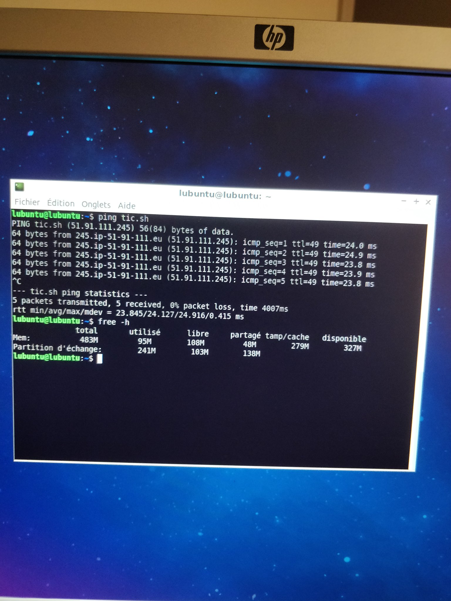

Ça part sur un lvm classique
Simple
Basique

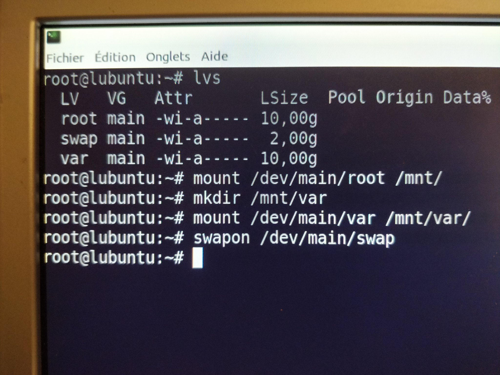

En suite c'est assez original et pratique, il y a une simple Archive a récupérer sur le serveur et a extraire dans le système de fichier.

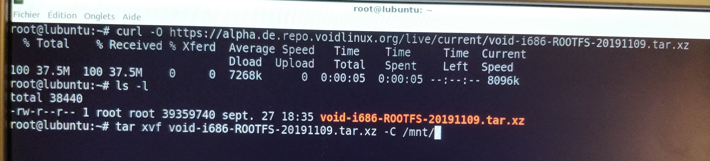

Et ça y es après avoir montré tout les systèmes de fichier virtuels (sys, dev,...) Je peux chroot

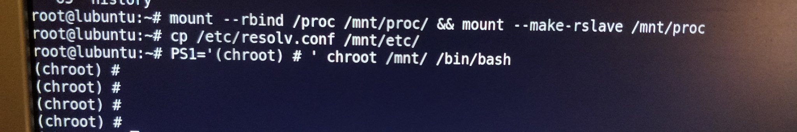

Et hop installation terminé après une configuration très simple du système.
Va-t-il boot jusqu'au bout ? Le suspense est total.

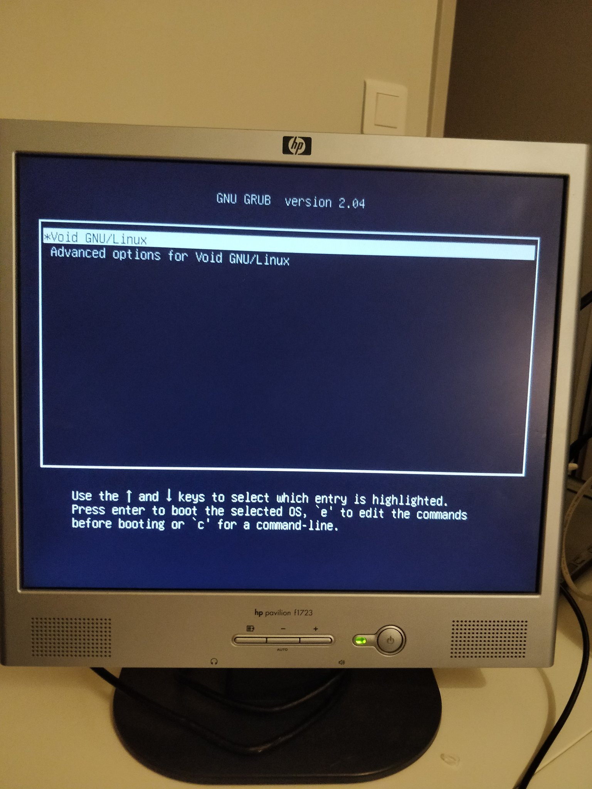

Ok c'est pas encore ca, dracut m'a dis qu'il ne trouvais pas de partition root...

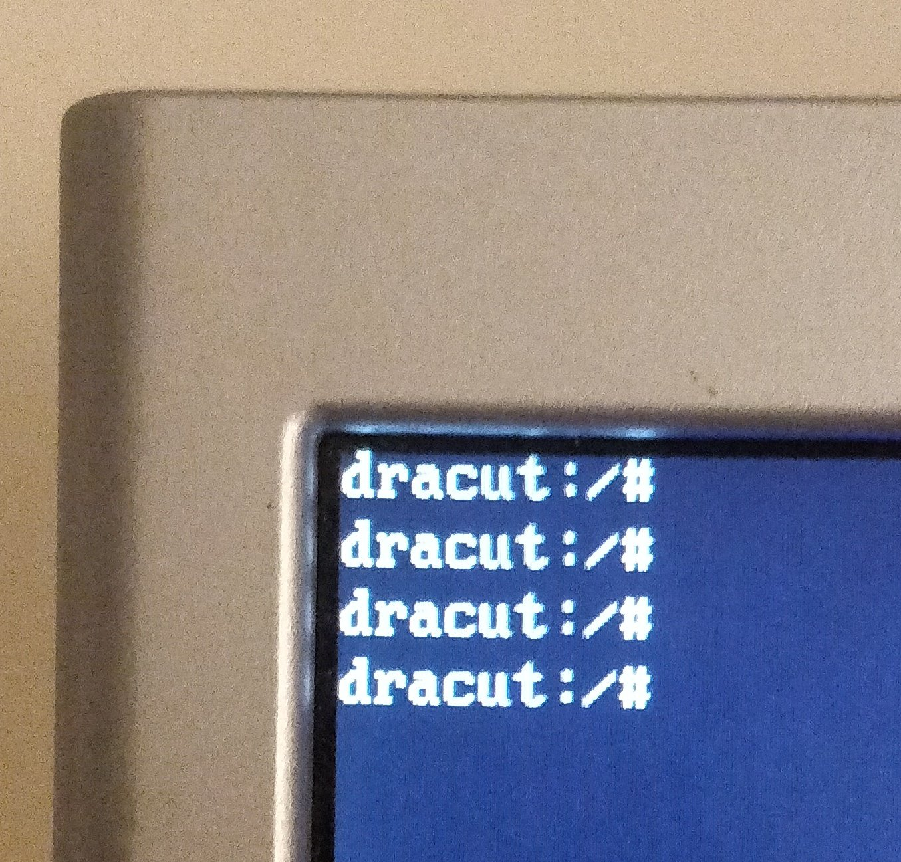

YES. (lvm2 qui était manquant)

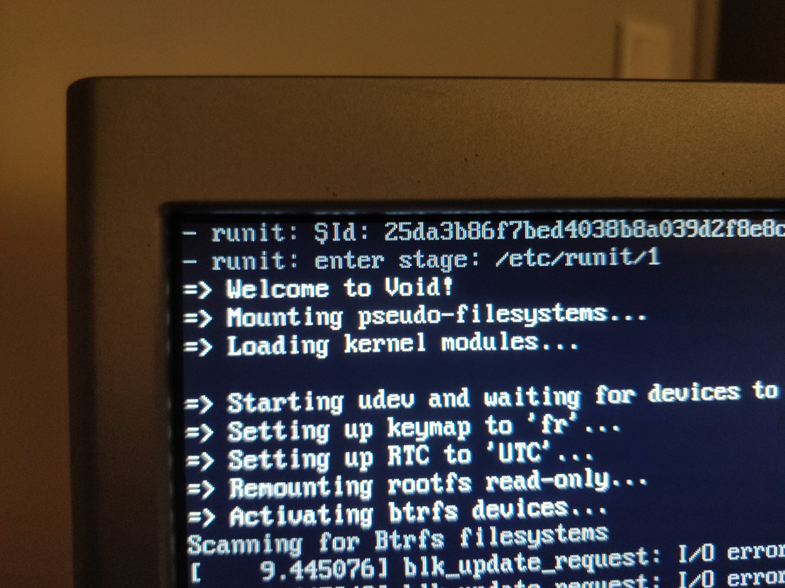

Et du coup au démarrage void ne prend que 30M en RAM et moins de 20G sur le disque pour 91 process.
that's my boy.

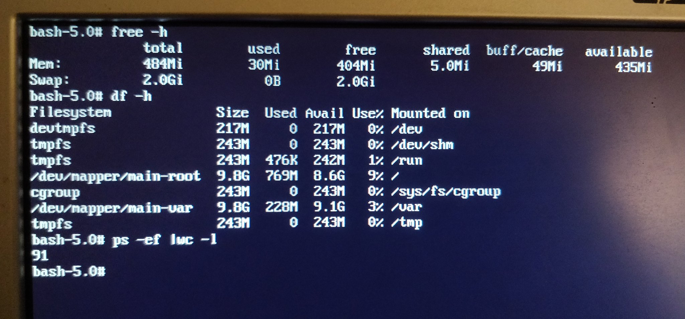
