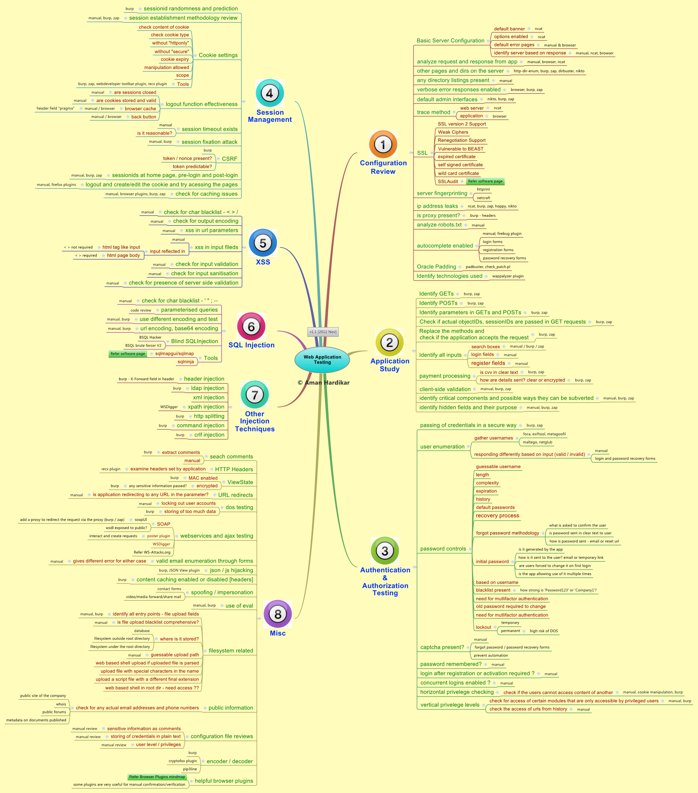
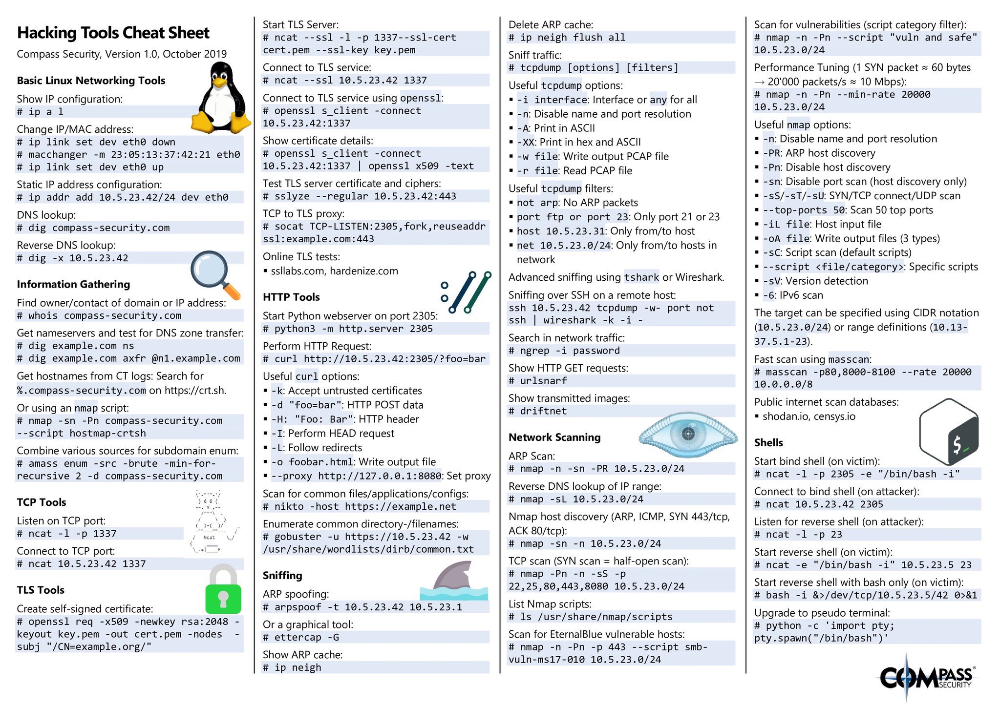
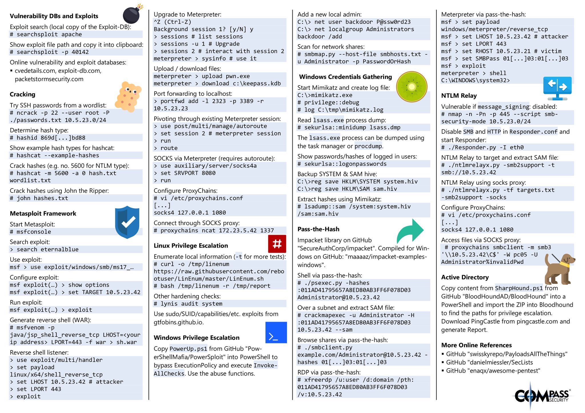

# Offensive Tips

---

If you're on a very restrictive Linux shell, this command will find writable directories for you.

```bash
find / -type d \( -perm -g+w -or -perm -o+w \) -exec ls -adl {} \;
```
([_source_](https://twitter.com/hakluke/status/1201247050567835648))

---

Une mindmap qui apporte une méthodologie pour tester les application web:



([_source_](https://www.amanhardikar.com/mindmaps/webapptest.html))

---

Un mémo très complet pour beaucoup d'outils de pentest intéressant:





([_source_](https://twitter.com/Alra3ees/status/1191808990927314944))

---


