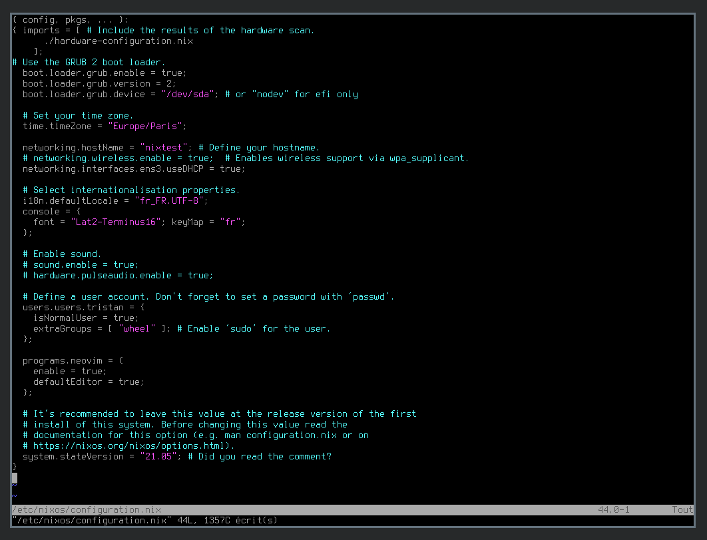
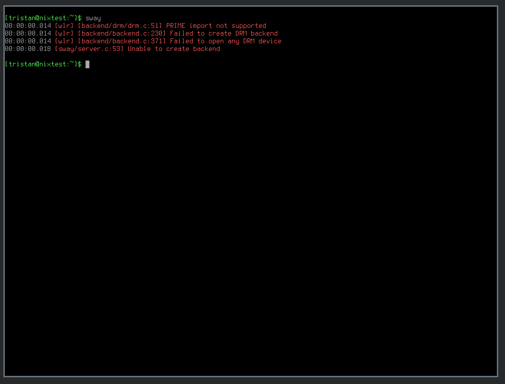
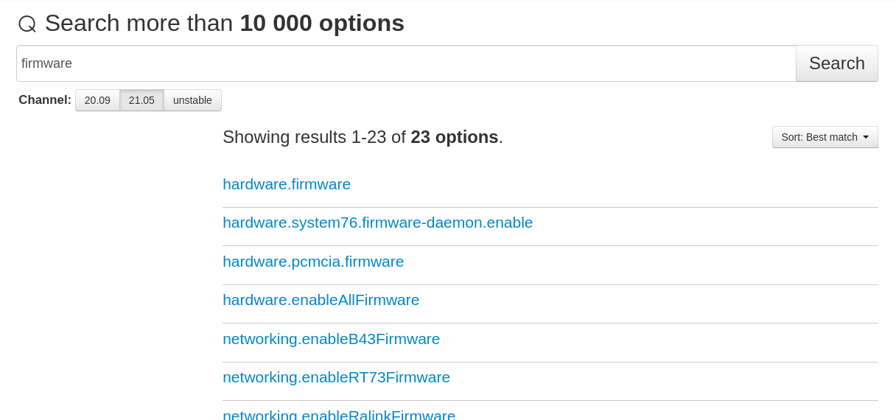
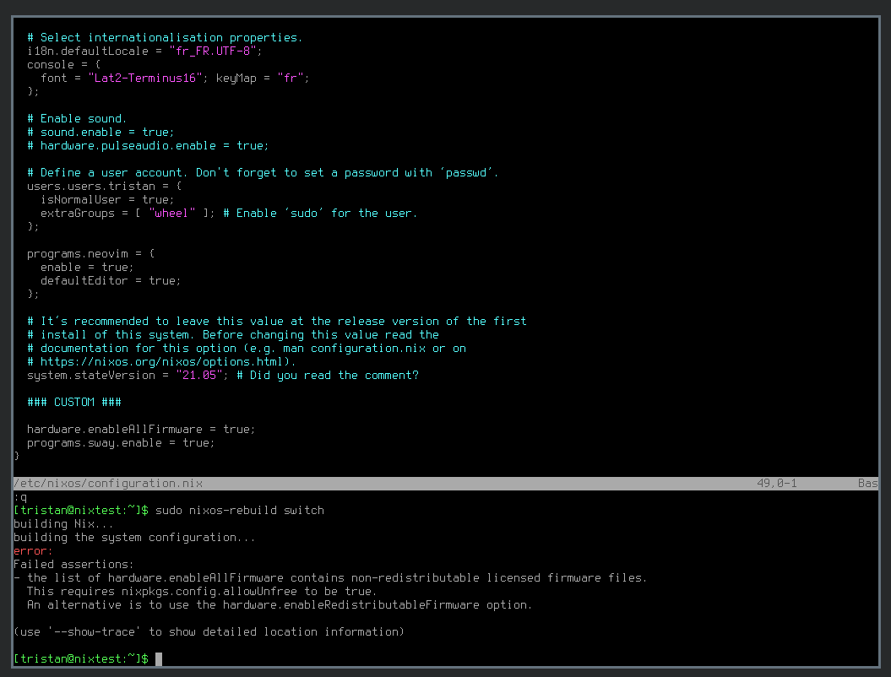
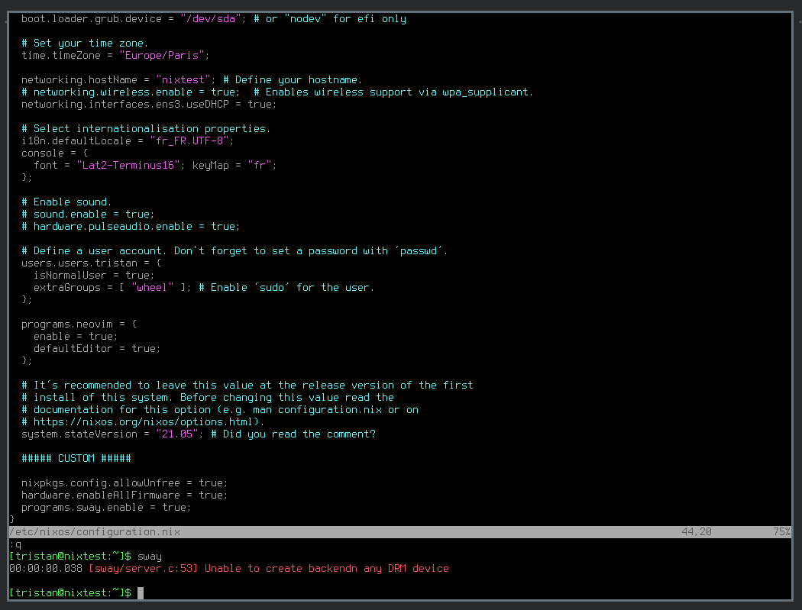
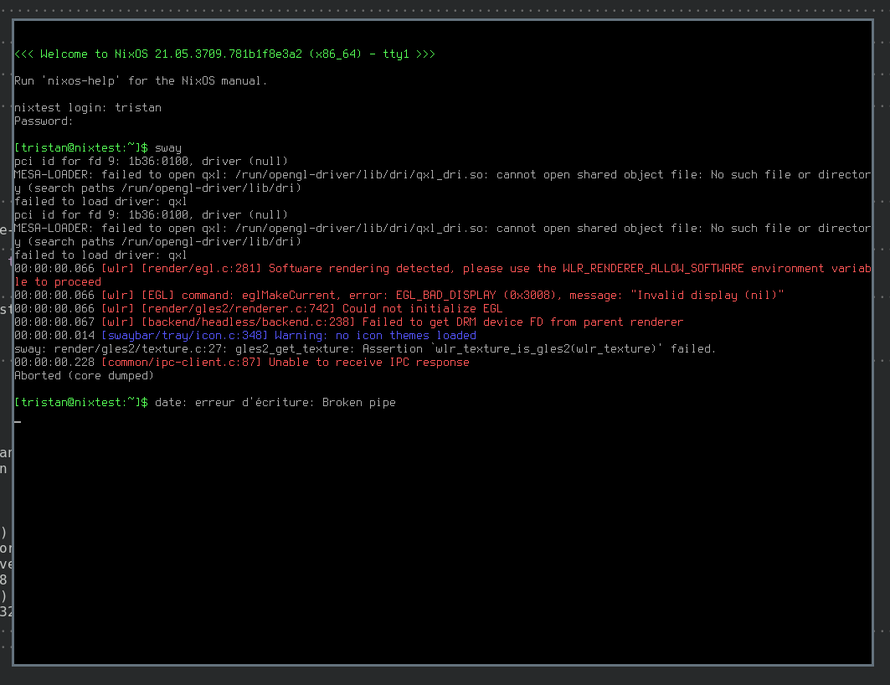
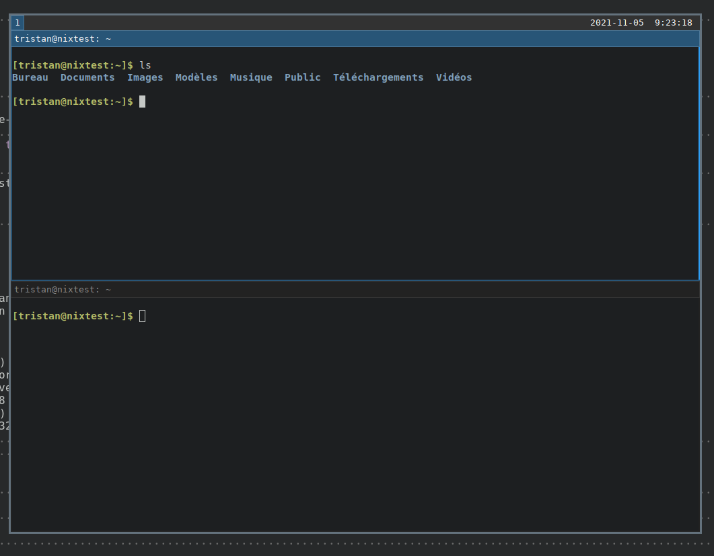

<p style="text-align: right">_- last update 06/11/2021 -_</p>

## Background

Je suis un fervent utilisateur de la distribution [ArchLinux](https://archlinux.org/)
depuis plusieurs années. J'aime sa simplicité de conception, sa sobriété et son
aspect DIY qui est encouragé par une communauté et une [documentation](https://wiki.archlinux.org/)
très technique. Cependant, j'ai aussi, au travers de mes expériences
professionnelles, expérimenté l'extraordinaire pouvoir de l'Infrastructure As 
Code ([IAC](https://en.wikipedia.org/wiki/Infrastructure_as_code)) au travers
d'outils comme Ansible et Terraform.

Les amateurs d'OS personnalisés et autres [ricers](https://www.reddit.com/r/unixporn/)
me comprendrons. Lorsque l'on a passé plusieurs heures  (ai-je entendu jours ?) 
à configurer un détail essentiel de notre OS, il est très frustrant de devoir
recommencer la configuration à 0 pour chaque nouveau système. J'aime passer du
temps à découvrir de nouveaux moyens d'améliorer mon environnement de travail
mais je DETESTE avoir à refaire 2 fois la même chose.

Ainsi, comme beaucoup d'autres, j'ai essayé de nombreuses solutions pour
automatiser ma configuration. L'utilisation d'un [dépôt git](https://github.com/0b11stan/dotfiles)
en combinaison d'outils comme [Terraform](https://www.terraform.io/), [Ansible](https://docs.ansible.com/ansible/latest/index.html),
ou [stow](https://www.gnu.org/software/stow/) ne m'a jamais parfaitement comblé.

Nixos est un système d'exploitation dont je serais bien incapable de lister tous
les avantages aussi exactement que la [page officielle](https://nixos.org/) du
projet. Il est construit autour d'un gestionnaire de paquet très innovant
appelé [nix](https://en.wikipedia.org/wiki/Nix_package_manager) et qui permet
de décrire de façon très précise la configuration du système jusque dans le
moindre détail, introduisant ainsi une forme d'Operating System As Code.

Cet article sera mis à jour régulièrement pour suivre mon avancée. L'objectif
étant de passer ma configuration actuelle sur NixOS et de documenter le tout
pour toutes les personnes qui rencontrerait les mêmes problèmes.

## Installation

Je vais réaliser toute la configuration dans un premier temps sur une machine
virtuelle, l'objectif étant à la fin de prendre le (ou les) fichiers nix pour
redéployer directement la configuration sur une machine physique.

Mon hyperviseur de prédilection est qemu/KVM. Je commence donc tout simplement
par créer un disque de 10G vierge qui accueillera le système de test:
```bash
qemu-img create -f qcow2 templates/nixos.qcow2 10G
```

Après avoir téléchargé l'ISO depuis [le site officiel](https://nixos.org/download.html)
et vérifier sa signature, je démarre mon image en bootant sur l'ISO.
```bash
qemu-system-x86_64 -enable-kvm -m 6G -hda templates/nixos.qcow2 \
  -cdrom ~/isos/nixos-minimal-21.05.3709.781b1f8e3a2-x86_64-linux.iso \
  -boot d
```

J'ai suivi [la partie "installation" du manuel utilisateur](https://nixos.org/manual/nixos/stable/#sec-installation).
L'installation est assez similaire de celle d'archlinux puisque le
partitionnement est à réaliser à la main, mais une très large partie de la
configuration propre à nixos est prise en charge par la commande nixos-install.

## Configuration

Après toute modification de la configuration, je joue la commande suivante
pour appliquer les changements à l'OS.

```bash
sudo nixos-rebuild switch
```

### Sway

Une fois le système installé, j'ai pu démarrer sur mon image pour accéder à un
login classique puis, après authentification, à un shell bash tout simple.
```bash
qemu-system-x86_64 -enable-kvm -m 4G -hda templates/nixos.qcow2
```

Malgré tout l'amour que je porte à tmux et aux programmes en ligne de commande,
l'utilisation d'un Windows Manager me parait plus que recommandé au 21e 
siècle. Mon WM de prédilection est [SwayWM](https://swaywm.org/). Son installation
représente ma première quête et ma première expérience avec NixOS.

Pour cela, je me base sur deux ressources principales:

* [le wiki de nixos sur sway](https://nixos.wiki/wiki/Sway)
* [la liste des options nix relatives à sway](https://search.nixos.org/options?query=sway)

Je pars à ce moment-là de la configuration de base
(`/etc/nixos/configuration.nix`).



Ajouter simplement la ligne `programs.sway.enable = true;` n'est pas suffisante 
pour faire fonctionner sway "out of the box".



Les erreurs DRM montrent qu'il manque du firmware. [Une recherche rapide](https://search.nixos.org/options?query=firmware) 
dans les options de nixos font ressortir `hardware.enableAllFirmware` qui nous 
permettra, en tout cas pendant la période de tests, de ne pas se soucier des 
problèmes de pilotes manquants.



Une erreur montre ensuite qu'il faut autoriser explicitement les firmware
non-libres. 



Après avoir ajouté cette option, le rebuild échoue encore, mais cette fois avec
moins d'erreurs.



Après beaucoup de recherche, je comprends qu'il faut que j'essaie [d'autres
émulateurs de carte graphique](https://wiki.archlinux.org/title/QEMU#Graphic_card).
La commande qemu devient donc la suivante.

```bash
qemu-system-x86_64 -enable-kvm -m 4G \
  -hda templates/nixos.qcow2 -vga qxl
```

Après avoir redémarré la VM et essayer de lancer sway à nouveau, une erreur 
très différente apparaît et nous indique qu'une variable d'environnement est
nécessaire pour autoriser l'utilisation de rendu graphique émulé.



Après avoir `export WLR_RENDERER_ALLOW_SOFTWARE=1`, sway démarre enfin.



Un problème subsiste: est-il possible de faire en sorte que nixos exporte la 
variable lui-même ?

La, je comprends qu'il va y avoir de la lecture à faire donc il faut reprendre du
début et RTFM. [La page ressources](https://nixos.wiki/wiki/Resources) du wiki 
est un bon point de départ.

Les deux ressources qui sont essentielles pour aller plus loin :

* L'article [How Nix works](https://nixos.org/guides/how-nix-works.html)
* [Nix Guide playlist](https://linktr.ee/nixos) [from Will T](https://www.youtube.com/channel/UCLsaznoh7qsE8sc3XQurubw)


