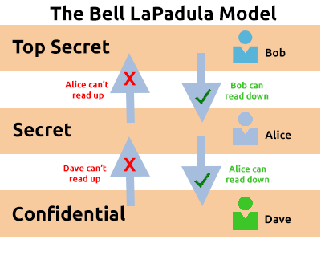
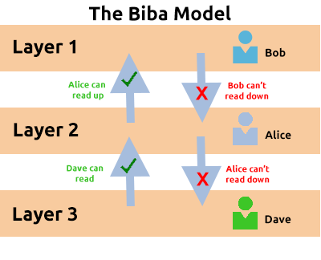
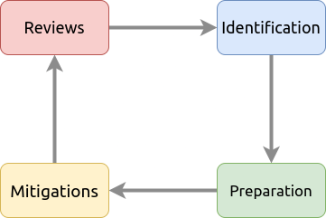
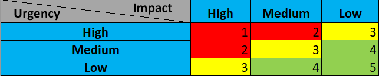

_- last update 09/02/2022 -_

IAM
---

### Conceptes

-	Moindre privilège
-	**IAM** : Identity and Access Management
-	**PAM** : Privilege Access Management
-	**PIM** : Privilege Identity Management
-	**vetting** : Equivalent du processus d'habilitation

Il y à pas mal de modèles qui sont mis en place dans les organisations. Le
problème principale c'est que ces modèles prennent pour aquis que les
organisations seront hyper hierarchisés.

### Bell-La Padula Model

-	Objectif: confidencialité
-	Principe: **"no write down, no read up"**

-	Très utilisé dans l'armé ou les organisations gouvernementales
-	Très simple à comprendre mais difficile à mettre en place
-	Part du principe que les membres de l'organisations sont formés et vérifiés
-	Pas du tout du zéro trust: les membres passent par un processus de *vetting*

### Biba Model

-	Objectif: confidencialité et intégrité
-	Principe: **"no write up, no read down"**

-	Utilisé la ou intégrité > confidencialité (ex: software dev)
-	Plus simple à mettre en place
-	Plus difficile de comprendre toutes les implications
-	Plus lourd, peut créer des bloquages

Threat Modelling (Management Du risque)
---------------------------------------

Le process est très cyclique:

1.	Preparation
2.	Identification
3.	Correction
4.	Revues

Les grandes partie d'un modèle de gestion des menaces :

-	Threat Intelligence: Recherche des menaces existantes (rôle d'un CERT)
-	Asset Identification: Identification du parc, cartographie
-	Mitigation Capabilities: Processus de correction (patch management)
-	Risk Assessment: Processus de maitrise des risques

Pour aider il y à des frameworks:

-	**PASTA** : **P**rocess for **A**ttack **S**imulation and **T**hreat **A**nalysis
-	**STRIDE**:
	-	**S**poofing: Authentifier les requêtes et les utilisateurs.
	-	**T**ampering: Les données doivent êtres protégé contre la modification (intégrité).
	-	**R**epudiation: Mettre en place du monitoring et du logging.
	-	**I**nformation Disclosure: Principe de moindre privilège.
	-	**D**enial of Service: Mettre en place de la redondance.
	-	**E**levation of Privilege: Controller les authorisations.

Réponse à incident
------------------

-	**IR** : Incident Response
-	**CSIRT** : Computer Security Incident Response Team

Etapes d'une réponse à incident:

1.	**Preparation** : Récupération des ressources et process existants.
2.	**Identification** : Identification de la menace.
3.	**Containment** : Mise en quarantaine des systèmes.
4.	**Eradication** : Suppression de la menace.
5.	**Recovery** : Reconstruction des systèmes pour reprendre l'activité.
6.	**Lessons** : Reporting et retour d'experience.
