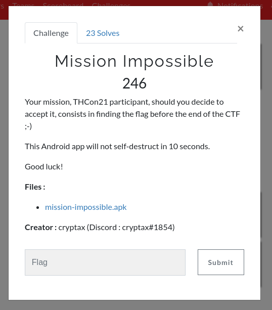
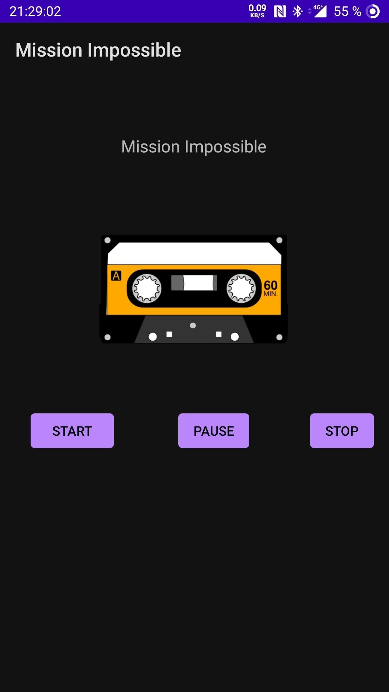
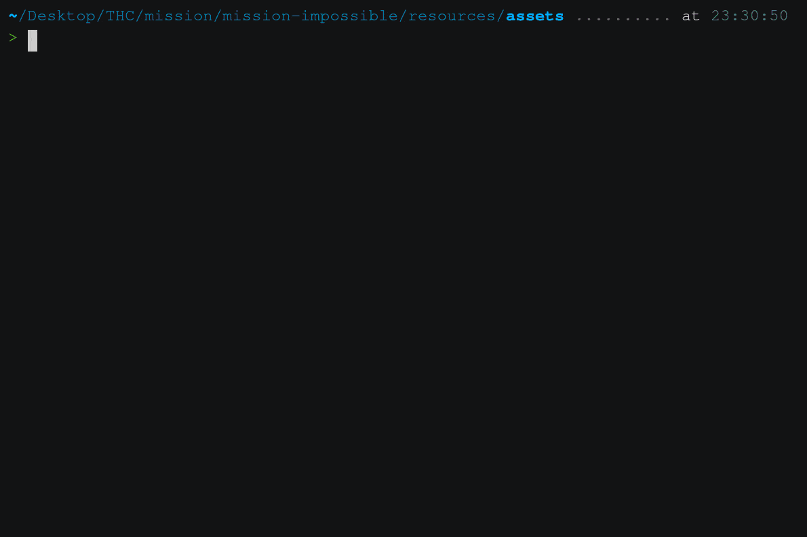

# Mission Impossible

Ce post fait série d'une série de writups qui fait suite au CTF de la [Toulouse
Hacking Convention](https://thcon.party/) que j'ai la chance d'avoir réalisé en
duo avec [@0x_Seb](https://twitter.com/0x_Seb).



Le 4ème challenge de la catégorie reverse est un challenge android. L'énoncé ne
donne pas beaucoup d'indices sur l'emplacement du flag, on va donc tout
simplement commmencer par executer l'appli après l'avoir télécharger.
```
> curl -O https://challenges.thcon.party/reverse-axelleapvrille-mission-impossible/mission-impossible.apk
  % Total    % Received % Xferd  Average Speed   Time    Time     Time  Current
                                 Dload  Upload   Total   Spent    Left  Speed
100 5696k  100 5696k    0     0  7336k      0 --:--:-- --:--:-- --:--:-- 7331k

```

On à un téléphone android sous la main et le plus simple lorsqu'on est sous
linux est d'utiliser la commande ADB fournis par la majorité des gestionaires de
packets. (L'option `-t` est nécessaire car le package est en [testOnly](https://developer.android.com/guide/topics/manifest/application-element#testOnly)):
```
> adb -t install mission-impossible.apk
Performing Streamed Install
Success
```

L'application est maintenant installé sur le téléphone. En l'ouvrant, on trouve
simplement l'image d'une casette audio et trois boutons qui nous permettent de
controller la lecture d'une piste audio du thème de mission impossible.



On sait maintenant que l'APK embarque très probablement une piste audio mais
aucune autre information n'a l'air intéressante pour le moment. Le le travail
de rétro-conception va pouvoir plus sérieusement commencer.

Le format APK n'est qu'une archive qui contient du bytecode compatible avec la
machine virtuelle d'android, une sorte de language intermédiaire qui va être
interprété dynamiquement pour générer du vrai code machine. Une fois extrait, ce
bytecode à la particularité d'être très facilement décompilable en un ensemble
de fichiers sources très proche de ceux écrit par les dévellopeurs. Nous
pourrions utiliser la commande `unzip` puis un décompileur sur chaque fichier
et chercher les bon arguments pour obtenir le code java d'origine. Heureusement
pour nous, le projet open source [jadx](https://github.com/skylot/jadx)
automatise toutes ces étapes en analysant le fichier `AndroidManifest.xml`
contenu dans l'APK.
```
> jadx mission-impossible.apk 
INFO  - loading ...
INFO  - processing ...
INFO  - done
```

Le resultat est un dossier `mission-impossible` contenant la structure d'un
projet android entièrement recompilable.
```
> tree -L 2 mission-impossible
mission-impossible
├── resources
│   ├── AndroidManifest.xml
│   ├── assets
│   ├── classes2.dex
│   ├── classes3.dex
│   ├── classes.dex
│   ├── META-INF
│   └── res
└── sources
    ├── android
    ├── androidx
    ├── com
    └── thcon21

9 directories, 4 files
```

Nous savons que les flag auront le format `THCon21{...}`. Le premier réflexe est
alors de chercher le format du flag dans l'arboresance de fichiers:
```
> grep -r THCon21 mission-impossible/
grep: mission-impossible/resources/assets/MissionImpossibleTheme.mp3: binary file matches
```

Un seul match dans la totalité du code correspond au format du flag et il se
trouve dans le fichier mp3, houra ? La commande strings nous permettra
d'extraire ce qui semble être le flag:
```
> strings MissionImpossibleTheme.mp3 | grep THCon21                
THCon21{DUMMY-SEARCH-MORE}
```

Malheureusment la célébration était un peu rapide. Cependant, le fichier ne
semble pas contenir qu'une piste audio, listons un peu le text qui se trouve
autour de notre pseudo-flag.
```
> strings MissionImpossibleTheme.mp3 | grep -A 10 -B 10 THCon21
(Ljavax/crypto/IllegalBlockSizeException;
%Ljavax/crypto/NoSuchPaddingException;
$Ljavax/crypto/spec/GCMParameterSpec;
!Ljavax/crypto/spec/SecretKeySpec;
Lthcon21/ctf/payload/MIRead;
Lthcon21/ctf/payload/smalldex;
MIRead.java
MMcjCaXX2AAY20H
MissionImpossible
R3JlZXR6RnJvbUNyeXB0YXgK
THCon21{DUMMY-SEARCH-MORE}
UTF-8
VEhDb24yMQo=
VILL
[Ljava/lang/String;
append
args
cipher
ciphertext
d0_you_acc3pt_it
decode
```

Les chaines parlent de java, de crypto et de ciphertext, il semble que l'on ai
du code compilé dans le fichier mp3. Malheureusment, l'outil `binwalk` ne
détecte aucune signature spécifique sur le fichier:
```
> binwalk MissionImpossibleTheme.mp3

DECIMAL       HEXADECIMAL     DESCRIPTION
--------------------------------------------------------------------------------

```

Il va falloir y aller à la main. On ouvre le fichier avec vim et on entre la commande `:%!xxd` pour l'éditer au format hexadécimale. On se rend rapidement
compte que la piste contient bien du bytecode avec une signature qui commence
par `.dex`, le tout encadré par des nullbytes:



On note donc les octets de début et de fin de la séquence:
```
0x0032d770 => 3331952
0x0032e580 => 3335552
```

La zone qui nous concerne est de `3335552 - 3331952 = 3600` octets la commande `dd` va nous permettre d'extraire cette partie du binaire:
```
dd bs=1 skip=3331952 count=3600 if=MissionImpossibleTheme.mp3 of=out.bin
```
